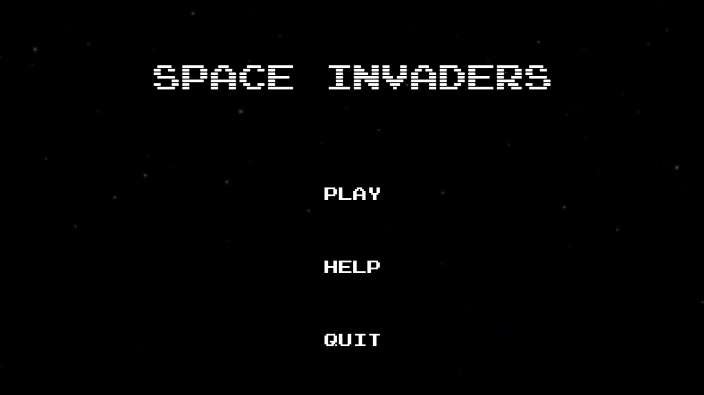
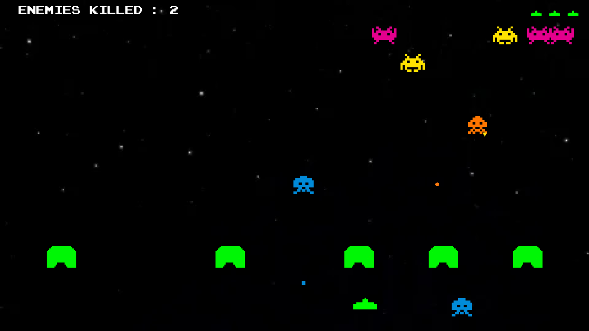

# Space Invaders

A space invaders game made using C++ & SFML

## Demo

[Download](https://github.com/MockJoke/SpaceInvaders/releases)

    
    

<!--   -->

<!-- 

  <a href="https://youtu.be/CdCLFUjtBYA" target="_blank">Demo Video</a>

 -->

## Features

- (The code architecture follows the oop guidelines)
- The core gameplay is similar to the original space invaders game, but more dynamic and fast paced
- Various types of enemies with unique movements, bullets, powerup drops and damage effects on player
- Various player special abilities on collecting powerup drops
- Background Music & Sound Effects
- UI/UX for health, score, title screen, splash screen etc.

### TODO:

- [ ] Game Over & Pause state
- [ ] More particle effects, sound effects, animations
- [ ] Fix enemy overlapping
- [ ] Fix certain issues with special abilities

## Credits & Attributions

#### Utilities:
- https://cmake.org/
- https://www.sfml-dev.org/

#### Graphics:
- Most of them are made using a vector graphics software
- https://fontstruct.com/
- https://opengameart.org/

#### Sounds: 
- https://freesound.org/people/RHumphries/packs/117/
- https://www.freesfx.co.uk/
- https://pixabay.com/sound-effects/

### Disclaimer

This project uses various assets obtained from different sources. While efforts have been made to ensure proper attribution, if any attribution is missing or incorrect, please contact me immediately so that proper credit can be given or the asset can be removed if necessary.

## License

This project is under license from MIT. For more details, see the [LICENSE](LICENSE) file.